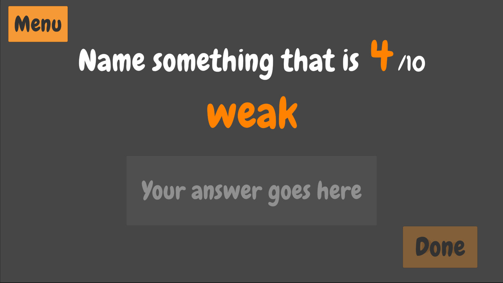

# Out of 10

A mobile pass-and-play game based on the popular board game Wavelength

Out of 10 doesn't have a traditional goal of the game, other than to incite discussion and playful arguments amongst friend groups.

## How to play

The first player takes hold of the device, taking care to hide the screen from other players. They are presented with a prompt with the following format:

The number and the adjective here are randomly selected.

Player one inputs their answer, **a labrador**, and confirms. They then pass the device to the rest of the group.

The group is then presented with the inverse of the original question:

The group argues on how weak, out of ten, a labrador is, and agrees on an answer. The true answer is revealed and the audience gets to argue with the player, before it's the next player's turn.

